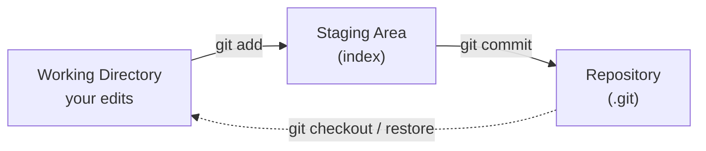

# Git & GitHub for Librarians — Lecture Notes (Tim)
UC Library Carpentry | 2026-05-13 | 9:00–10:30 AM PT

---

## 9:00 AM — Welcome & Setup Verification (20 min)

**Goal:** Everyone has Git installed and a GitHub account before we touch a command.

### Talking points
- Welcome and quick introductions (instructors + helpers)
- Today's agenda: two episodes before break, then Seth takes GitHub/sharing
- All work happens in the **shell**. If you haven't used it before, that's fine, we go slow.
- Point to the **workshop page** for setup instructions and collaborative notes link

### Setup checks (work through with helpers)
- `git --version` should return something; if not, stop and fix now
- **GitHub account** created? Confirm username is set (remind them: usernames and emails are publicly visible by default)
- Can everyone reach github.com?
- **Text editor** configured? We'll set this in Episode 2 but flag it now

### Asides
- Helpers: circulate during setup check, don't wait for people to raise their hand
- If someone is on Windows and has line-ending issues later, flag `core.autocrlf`. We'll address it when it comes up.

---

## 9:20 AM — Episode 1: What is Git/GitHub? (25 min)

**Slides:** [introduction-slides](https://jt14den.github.io/2026-05-11-uc-lc/introduction-slides/)

**Goal:** Learners understand *why* version control matters before they touch any commands.

Follow the slide deck. It covers the problem, version control benefits, Git vs. GitHub, and library use cases.

### Asides
- The "why" is more important than the commands. Spend real time on it.
- Don't go deep on branching. Not in this lesson, and it'll confuse people early.

### Segue to the Terminal

*After the discussion slide ("What files do you wish you had a complete history for?"):*

> "That's exactly what we're going to fix today. Let's open a terminal and start building that history."

Walk through the "To the Terminal" slide. Wait for everyone to confirm `git --version` works before moving on. Anyone with a problem should surface here, not mid-command.

---

## 9:45 AM — Episode 2: Getting Started (init, add, commit) (45 min)

**Goal:** Learners create a repo, stage a file, and make their first commit. They understand the two-stage workflow.

Worth saying upfront: the biggest barrier to Git is usually just the **terminology**. Commands follow the pattern `git verb options`: verb is the action, options are detail. Once you see the pattern, it clicks.

---

### Step 1: Configure Git (5 min)

**Show first, then have them follow along.**

```bash
git config --list
```

- Check what's already set. Many will have something; some will have nothing.
- Look for `user.name` and `user.email` in the output
- Output varies by OS: Mac shows credential helpers, Windows shows LFS/SSL settings, Linux may show nothing

Set your **identity** (email must match your GitHub account):

```bash
git config --global user.name "Your Name"
git config --global user.email "yourname@domain.name"
```

- Same email you used to sign up for GitHub
- If they don't match, commits won't be attributed to your account

Set your **text editor** to Nano, easiest for beginners:

```bash
git config --global core.editor "nano -w"
```

- Nano works on Mac, Windows, and Linux
- Runs right in the shell, no separate window
- On-screen shortcuts are always visible at the bottom

Set the **default branch name**:

```bash
git config --global init.defaultBranch main
```

- Matches GitHub's default so everything stays in sync

**Walk through Nano controls now.** Don't assume they know it:
- `Ctrl+O` then `Enter` to save — think "Write **O**ut"
- `Ctrl+X` to exit
- Or: `Ctrl+X` → `Y` → `Enter` (save-and-exit in one flow)
- Say it once out loud: "Write Out to save, then Exit to leave."

### Asides
- `--global` means this applies to all repos on their machine, not just this one
- Email must match GitHub for commits to be attributed correctly
- If someone is on Windows, mention `core.autocrlf` may matter for line endings. Note it, don't deep-dive.

---

### Step 2: Create a Repository (5 min)

A **repository** is a data structure used to track changes to a set of project files over time. It lives as a hidden `.git/` folder inside your project.

```bash
mkdir hello-world
cd hello-world
git init
```

- Git creates a hidden `.git/` folder. That *is* the repository.
- Everything Git knows about this project lives in `.git/`. Don't delete it.

```bash
git status
```

- Shows branch, commit status, and what's tracked
- `git status` is your best friend. Run it constantly, we'll use it after every step.

### Asides
- Run `ls -a` to show the `.git/` directory exists. "Hidden" just means the name starts with a dot.
- Flags like `-a` are command line options you can add to shell commands to change their behavior
- Git does not track anything automatically. You always tell it what to watch.

---

### Step 3: Add and Commit (25 min)

This is the core of the lesson. **Slow down here.**

**Create a file:**

```bash
touch index.md
git status
```

- Git sees an **untracked** file. It knows it exists but isn't watching it.
- `.md` is **Markdown**, a lightweight plain-text format
- The filename shows up in **red**: untracked or unstaged

**Stage the file:**

```bash
git add index.md
git status
```

- File moves to the **staging area**. Shows as "Changes to be committed".
- The filename is now **green**: staged and ready to commit

**Edit the file:**

```bash
nano -w index.md
```

- Add something simple: `# Hello, world!` (the `#` makes it a Markdown header)
- Save and exit (`Ctrl+O`, `Enter`, `Ctrl+X`)

**Check status again:**

```bash
git status
```

- Two things now: the staged (empty) version AND the modified-but-unstaged version
- This is the key moment. Staging only captured what you `add`ed, not the edit you just made.
- The same file shows up in both sections. This surprises people, so pause here.
- Explain it directly: "Git staged the empty file. Then you edited it. Those are two different states — Git is showing you both."

**Stage the updated version:**

```bash
git add index.md
git status
```

- Both changes are now in the staging area, ready to commit

**Commit:**

```bash
git commit -m 'Add index.md'
```

- Git records a **permanent snapshot** with metadata: who, when, message
- The **commit hash** in the output is a fingerprint of this exact state
- Commit messages should be short and specific. Future-you will read them.

**View history:**

```bash
git log
```

Output looks like this:

```
commit a1b2c3d4e5f6... (HEAD -> main)
Author: Your Name <yourname@domain.name>
Date:   Wed May 13 09:45:00 2026 -0700

    Add index.md
```

- Shows commit hash, author, timestamp, message
- Every commit is permanent and addressable by its hash
- Commits are ordered into sequences called **branches**. Each one points back to the commit before it.
- Over time this builds a mini-history of your process: who changed what, when, and why

### Talking points: the two-stage workflow



- `git add` specifies *what* will go in the next snapshot, putting things in the staging area
- `git commit` *actually takes* the snapshot: permanent, with metadata
- The staging area lets you be precise. Commit only what belongs together.
- This two-stage process gives you fine-grained control over what goes into each commit
- **Why bother with two steps?** It lets you commit part of your changes — say, two edited files out of five — without committing everything at once. You choose what groups together logically.

**Photography metaphor** (it's in the lesson, use it):
- `git add` = choosing who stands in the photo
- `git commit` = pressing the shutter
- `git commit -a` = grabbing everyone and pressing the shutter without looking first

**Commit messages matter:**
- Write as an **imperative**: "Add index.md", not "Added" or "Adding"
- Future-you will read these. Make them useful.
- Omit `-m` and Git opens your editor for a longer message

**Reference the staging area diagram** at the bottom of the lesson:
https://librarycarpentry.github.io/lc-git/02-getting-started.html
Show it if the lesson is open, or sketch the three boxes on screen.

### Asides
- Don't use `git commit -a` as a habit. It skips the staging area and can pull in things you didn't mean to commit.
- The commit hash is a fingerprint of the exact state. You can always get back to any hash.
- If someone accidentally commits the wrong thing, reassure them. We can fix it.

---

### Step 4: Quick Check (5 min, before break)

```bash
git log
git status
```

Ask the group:
- "What does `git add` do?"
- "What does `git commit` do?"
- "What's the difference between the working directory and the staging area?"

**Segue to Seth:**
- Everything so far is local. It only exists on your machine.
- If you wanted to work with someone else, they'd have no way to see any of this.
- That's what Episode 3 fixes: sharing your work on GitHub.

### Asides
- For remote teaching: use a collaborative board (Miro, Jamboard). Learners add color-coded notes for each command type.
- Good moment to say: the two-stage workflow feels weird at first. It clicks after a few sessions.

---

### If Time Allows: git diff and git log options

*(Commands from later episodes. Only go here if you finish Step 4 early. Skip cleanly if not.)*

**See what changed before staging:**

```bash
nano -w index.md
```

- Add a second line, save, then:

```bash
git diff
```

- Shows what's changed in the working directory vs the last commit
- `+` lines are new, `-` lines are removed

```bash
git add index.md
git diff
```

- Nothing shown. `git diff` only shows unstaged changes.
- Use `git diff --staged` to see what's in the staging area

**Compact log view:**

```bash
git log --oneline
```

- One line per commit. Useful once history gets long.
- The one log flag worth remembering

### Asides
- `git diff` is most useful *before* `git add` as a self-check
- `git log --oneline` is the one to remember

---

## 10:30 AM — Break (10 min)

Remind learners:
- Back at **10:40**
- **Seth** takes over for GitHub/sharing (Episode 3)
- Leave terminal open, stay in `hello-world/` directory

---

*Notes continue in `git-lecture-notes-seth.md` (Episode 3 onward)*
